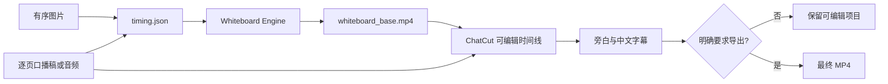

# Whiteboard Explainer Video Skill

[](LICENSE)
[](skills/whiteboard-explainer-video/SKILL.md)
[](https://github.com/2510466299/whiteboard-video-engine)

将知识图、海报、漫画页或分镜图片制作成“只手绘非文字部分”的讲解视频：原图文字从第一帧保持清晰，绘制与上色节奏由实际旁白时长驱动，并可继续进入 ChatCut 完成配音、中文字幕和可编辑时间线。

> [!IMPORTANT]
> 本仓库是 Codex 编排 Skill，不包含渲染引擎、模型权重或 ChatCut。本 Skill 使用 [`2510466299/whiteboard-video-engine`](https://github.com/2510466299/whiteboard-video-engine)，该仓库 Fork 自 MIT 许可的 [`gnipbao/whiteboard-video-engine`](https://github.com/gnipbao/whiteboard-video-engine)。本项目不是上游作者的官方发行版。

## 它解决什么问题

普通“图片转手绘视频”容易把中文文字也重新描画，导致错字、缺笔和变形。本 Skill 将职责拆开：

- 图片文字保持原样，从每页第一帧就可读；
- 只让人物、插图、图标、箭头、边框和装饰经历勾线与上色；
- 先测量真实旁白，再决定每页及总时长，不套用固定 150 秒；
- 旁白、页面边界和字幕提示点独立校验；
- 默认保留可编辑时间线，只有明确要求时才导出最终视频。



## 核心能力

| 能力 | 行为 |
| --- | --- |
| 非文字手绘 | 只动画插图、人物、图标、箭头、边框和装饰 |
| 原文保护 | 原图中的中文和英文从首帧保留，不进入错误的线稿重建 |
| 动态时长 | 使用实测旁白时长、绘制复杂度和自然停顿生成 `timing.json` |
| 自动设备选择 | PyTorch 线稿任务按 CUDA → Apple MPS → CPU 选择设备 |
| 三种工作模式 | `full`、`render-only`、`post-only` |
| 连续旁白 | 禁止意外空白和重叠，只允许时间表中记录的页尾停顿 |
| 中文字幕 | 只从旁白生成，不重复识别图片文字；支持专有名词显示纠错 |
| 安全边界 | 付费 TTS 前确认稿件和音色；默认不导出成片 |

> [!NOTE]
> Apple MPS 加速作用于兼容的 PyTorch 线稿模型。路径追踪、视频编码和部分图像处理仍可能使用 CPU 或 FFmpeg。

## 与上游项目的关系

底层渲染能力来自 [gnipbao/whiteboard-video-engine](https://github.com/gnipbao/whiteboard-video-engine)。该项目使用 [MIT License](https://github.com/gnipbao/whiteboard-video-engine/blob/main/LICENSE)，允许使用、修改和再分发，但要求保留版权及许可声明。

配套 Fork [2510466299/whiteboard-video-engine](https://github.com/2510466299/whiteboard-video-engine) 保留了上游完整历史和许可证，并增加：

- `--text-preserve`：识别并保留原图文字区域；
- CUDA → Apple MPS → CPU 的线稿模型设备选择；
- macOS Vision 文字框辅助检测，以及非 macOS 的保守图像掩码回退；
- 对应 CLI、设备选择和文字保护测试。

本 Skill 在此基础上增加多页编排、旁白驱动时间轴、ChatCut 后期路由、字幕约束、验证门和临时文件清理规则。

## 使用条件

### 必需

- Git；
- Python 3.11 或更高版本，推荐 Python 3.12；
- [uv](https://docs.astral.sh/uv/)；
- [FFmpeg](https://ffmpeg.org/)；
- 支持项目级 Skill 的 Codex 环境；
- 本项目配套的 `whiteboard-video-engine` Fork。

macOS 可使用 Homebrew 安装基础工具：

```bash
brew install git uv ffmpeg
```

### 按需安装

- PyTorch、Informative Drawings 或 Anime2Sketch：从照片/插画提取线稿；
- ChatCut：制作可编辑时间线、配音和字幕；
- TTS 服务：当用户没有现成旁白音频时使用。

本仓库和引擎 Fork **不包含、也不会静默下载模型权重**。模型仓库、权重、字体和媒体素材适用各自的许可证。

## 安装

### 1. 安装兼容引擎

```bash
git clone https://github.com/2510466299/whiteboard-video-engine.git
cd whiteboard-video-engine
uv sync --python 3.12 --extra full
uv run whiteboard doctor
```

只做基础 SVG 或已有线稿渲染时，可以先安装核心依赖：

```bash
uv sync --python 3.12
```

线稿模型的目录和环境变量配置见引擎 Fork 的 [`docs/MODELS.md`](https://github.com/2510466299/whiteboard-video-engine/blob/main/docs/MODELS.md)。

### 2. 安装 Codex Skill

回到希望存放源码的目录：

```bash
git clone https://github.com/2510466299/whiteboard-explainer-video-skill.git
mkdir -p "${CODEX_HOME:-$HOME/.codex}/skills"
cp -R whiteboard-explainer-video-skill/skills/whiteboard-explainer-video \
  "${CODEX_HOME:-$HOME/.codex}/skills/"
```

重新打开 Codex 会话后，可以显式调用：

```text
$whiteboard-explainer-video
```

如果引擎不在当前项目或工作区内，请在请求中提供引擎的绝对路径。Skill 不会自行下载引擎或模型。

### 3. 验证安装

在引擎目录执行：

```bash
uv run whiteboard render-photo --help
```

帮助信息中应包含 `--text-preserve`。在 Apple Silicon Mac 上可以检查 PyTorch MPS：

```bash
uv run python -c "import torch; print(torch.backends.mps.is_built(), torch.backends.mps.is_available())"
```

两个值均为 `True` 才表示当前 PyTorch 运行时可以使用 MPS。

## 三种模式

| Mode | 适用场景 | 主要输出 |
| --- | --- | --- |
| `full` | 从图片和口播稿开始，完成手绘底片、旁白、字幕及后期 | `narration.md`、`timing.json`、`whiteboard_base.mp4`、可编辑 ChatCut 时间线 |
| `render-only` | 只需要保持原文字的静音手绘底片 | `timing.json`、`whiteboard_base.mp4` |
| `post-only` | 已有底片，只处理旁白、字幕和时间线 | 可编辑 ChatCut 时间线、旁白和字幕状态 |

默认模式为 `full`。如果请求明确排除配音或 ChatCut，则选择 `render-only`；如果已有底片，则选择 `post-only`，不会重新渲染画面。

## 快速开始

### 完整制作

```text
使用 $whiteboard-explainer-video。
目录里有 10 张按文件名排序的中文知识图和逐页口播稿。
只手绘非文字部分，原图文字从第一帧保持原样；音色使用 dayi。
每页时长按实际配音决定，添加中文字幕，先保留可编辑时间线，不要导出。
引擎路径：/absolute/path/to/whiteboard-video-engine
```

### 只生成手绘底片

```text
使用 $whiteboard-explainer-video 的 render-only 模式。
我有 8 张中文海报和对应的逐页旁白音频。
按实测音频时长生成 timing.json 和静音 whiteboard_base.mp4；
保留原海报文字，只动画非文字元素，不生成配音、不进入 ChatCut。
```

### 只做配音和字幕后期

```text
使用 $whiteboard-explainer-video 的 post-only 模式。
我已有 whiteboard_base.mp4、timing.json 和逐页口播稿。
在 ChatCut 中加入已确认的旁白和中文字幕，字幕只来自旁白，
修正 Claude、Windsurf 等专有名词的显示，先不要导出。
```

## 直接使用引擎

不经过完整 Skill 编排时，可以直接生成单页文字保护视频：

```bash
uv run whiteboard render-photo input.png \
  -o output/scene.mp4 \
  --duration 15 \
  --fps 30 \
  --lineart-provider anime2sketch \
  --tail-color 4 \
  --text-preserve
```

`--duration` 是当前场景从开始绘制到完成上色的时长，不包含额外末帧停留。多页工作流会根据 `timing.json` 另外添加停留并合并场景。

## 输入与输出

### 输入

- 一张图片、有明确顺序的多张图片，或图片目录；
- 逐页口播稿、完整口播稿，或已有旁白音频；
- 可选的音色、语言、画布、帧率、总时长约束和 ChatCut 项目。

### 默认保留

```text
任务目录/
├── narration.md          # 最终逐页口播稿
├── timing.json           # 可重建的页面、旁白、绘制、上色和停留时间
└── whiteboard_base.mp4   # 无烧录字幕的静音手绘底片
```

`full` 和 `post-only` 还会保留可编辑 ChatCut 时间线。只有用户明确要求导出时，才生成最终配音字幕视频。

## 时间规则

- 已有音频时，以实测音频长度为权威来源；
- 只有稿件时，先确认稿件和音色，再生成 TTS 并测量；
- 每页旁白结束后通常保留 0.4–1.0 秒自然停顿；
- 上色结束尽量靠近旁白结束，目标误差不超过 ±0.5 秒；
- 场景不能早于旁白结束；
- 请求的时长上限与完整旁白冲突时，必须报告冲突，不能静默截断或变速。

完整字段和不变量见 [`timing-manifest.md`](skills/whiteboard-explainer-video/references/timing-manifest.md)。

## 配音、字幕和导出边界

- 付费 TTS 前必须确认最终稿件和音色；
- 字幕只绑定旁白轨道，不读取图片文字或笔记；
- 专有名词可以只修改字幕显示，不擅自改变已确认音频；
- 默认停在可编辑时间线；
- 未明确要求时不导出最终 MP4；
- ChatCut、TTS 服务的账号、鉴权、可用性和价格不由本仓库提供或保证。

## 故障排查

### `torch.backends.mps.is_available()` 为 `False`

检查：

1. 是否为 Apple Silicon Mac；
2. Python 是否为 arm64，而不是通过 Rosetta 运行的 x86_64；
3. macOS 与 PyTorch 版本是否支持 MPS；
4. `torch.backends.mps.is_built()` 是否为 `True`。

MPS 不可用时会回退到 CPU，不影响基础工作流，只会降低线稿模型速度。

### 找不到 `--text-preserve`

你很可能安装了上游原版，而不是本项目的兼容 Fork。检查：

```bash
git remote -v
uv run whiteboard render-photo --help
```

远程地址应指向 `2510466299/whiteboard-video-engine`。

### 提示线稿模型缺失

模型不会自动下载。按照引擎 Fork 的 `docs/MODELS.md` 配置 Informative Drawings 或 Anime2Sketch；如果已有线稿或 SVG，可绕过模型提取步骤。

### 中文文字仍有遮挡或缺笔

文字保护采用 OCR/图像掩码的保守策略，不保证所有字体、低对比度文字或复杂背景都能一次正确识别。先渲染代表页并检查首帧、绘制中、上色中和末帧；识别不可靠时停止批量制作并调整素材或文字区域。

### 旁白 80 秒，但成片要求 60 秒

如果不允许删稿、变速、重录或拆分，这组约束无法同时满足。Skill 会停止并要求放宽至少一个约束，不会截断旁白。

## 项目结构

```text
skills/whiteboard-explainer-video/
├── SKILL.md
├── agents/
│   └── openai.yaml
└── references/
    ├── input-output-contract.md
    ├── timing-manifest.md
    └── verification-checklist.md
```

- `SKILL.md`：模式选择、核心流程和工具路由；
- `input-output-contract.md`：三种模式的授权边界与交付物；
- `timing-manifest.md`：动态时间表格式、约束及引擎命令映射；
- `verification-checklist.md`：音频、画面、字幕、导出和清理检查。

## 已知限制

- 文字保护需要逐页视觉检查，尤其是艺术字体、浅色文字和复杂背景；
- PyTorch MPS 并不保证所有模型算子均受支持，必要时会使用 CPU；
- 不捆绑 Informative Drawings、Anime2Sketch 或其权重；
- 不提供 ChatCut 或 TTS 服务账号；
- Skill 是工作流编排，不替代底层引擎、人工内容审核或许可证检查；
- 公开仓库不包含用户素材、测试视频或生成结果。

## 安全与隐私

- 不要把 API Key、访问令牌或私有素材提交到项目仓库；
- 每次任务使用独立临时目录，结束后删除中间场景、缓存、截图和日志；
- 保留用户原素材、最终口播稿、`timing.json`、手绘底片及明确要求的导出文件；
- 使用外部 TTS 或后期服务前，先检查其隐私政策和费用。

## License 与致谢

本 Skill 仓库使用 [MIT License](LICENSE)。

底层引擎 Fork 自 [gnipbao/whiteboard-video-engine](https://github.com/gnipbao/whiteboard-video-engine)，保留其完整历史、版权声明和 [MIT License](https://github.com/2510466299/whiteboard-video-engine/blob/main/LICENSE)。感谢原项目贡献者提供白板渲染基础。

线稿模型及其他第三方组件适用各自许可证。本 Fork 和本 Skill 均不是上游作者的官方发行版，上游作者也未对本项目作出背书。
