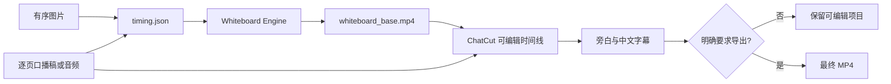

# Public README and Engine Fork Implementation Plan

> **For agentic workers:** REQUIRED SUB-SKILL: Use superpowers:subagent-driven-development (recommended) or superpowers:executing-plans to implement this plan task-by-task. Steps use checkbox (`- [ ]`) syntax for tracking.

**Goal:** Publish an installable, well-attributed Whiteboard Explainer Video Skill with a compatible public fork of the MIT-licensed rendering engine.

**Architecture:** Keep orchestration and rendering in separate repositories. The Skill repository contains user documentation and Codex instructions; the engine fork preserves upstream history and carries the text-preservation and device-selection changes required by the Skill.

**Tech Stack:** GitHub CLI, Git, Markdown, Mermaid, Python 3.12, uv, PyTorch, FFmpeg, pytest, Codex Skill validator

---

## File map

Skill repository `2510466299/whiteboard-explainer-video-skill`:

- Create `README.md`: public overview, installation, modes, examples, outputs, troubleshooting, attribution, and limitations.
- Create `LICENSE`: MIT license for the Skill repository.
- Keep `skills/whiteboard-explainer-video/**`: validated Skill package; no behavior changes unless README validation exposes a contradiction.
- Keep `docs/superpowers/specs/2026-08-24-public-readme-and-engine-fork-design.md`: approved release design.
- Keep this plan as the execution record.

Engine fork `2510466299/whiteboard-video-engine`:

- Modify `README.md`: add a concise fork notice and links.
- Modify `README.en.md`: add the same notice in English.
- Modify `README.zh-CN.md`: add the same notice in Chinese.
- Preserve `LICENSE` and all upstream source/history.
- Apply existing local commits `3740760` and `5ce820e` for the design record, MPS-aware line-art wrappers, text preservation, CLI flags, and tests.

## Task 1: Establish reproducible pre-publication baselines

**Files:**
- Inspect: Skill repository tree and GitHub metadata
- Inspect: `/Users/undersdong/Desktop/03-技术项目/codex/Course_design/story_write2c/whiteboard-video-engine`
- Create temporarily: `/private/tmp/whiteboard-skill-public-release-20260824/audit/pre-public.txt`

- [ ] **Step 1: Record the Skill repository baseline**

```bash
mkdir -p /private/tmp/whiteboard-skill-public-release-20260824/audit
gh repo view 2510466299/whiteboard-explainer-video-skill \
  --json visibility,defaultBranchRef,url > \
  /private/tmp/whiteboard-skill-public-release-20260824/audit/pre-public.txt
git status --short
git ls-files
```

Expected: visibility is `PRIVATE`; the worktree is clean; no root `README.md` or `LICENSE` exists.

- [ ] **Step 2: Record the upstream and local engine relationship**

```bash
gh api repos/gnipbao/whiteboard-video-engine/commits/main --jq '.sha'
git -C /Users/undersdong/Desktop/03-技术项目/codex/Course_design/story_write2c/whiteboard-video-engine \
  log --oneline origin/main..HEAD
```

Expected: upstream `main` is `3155215...`; local history contains exactly `3740760` and `5ce820e` after that commit. If upstream changed, fetch it and replace the expected base with the current SHA before continuing.

- [ ] **Step 3: Capture failing public-document checks**

```bash
test -f README.md
test -f LICENSE
```

Expected: both commands fail before implementation.

## Task 2: Create the public engine fork and apply compatible changes

**Files:**
- Create remote repository: `2510466299/whiteboard-video-engine`
- Create temporarily: `/private/tmp/whiteboard-skill-public-release-20260824/engine`
- Modify: `README.md`
- Modify: `README.en.md`
- Modify: `README.zh-CN.md`

- [ ] **Step 1: Create a GitHub-native fork and clone it**

```bash
gh repo fork gnipbao/whiteboard-video-engine --clone=false
git clone https://github.com/2510466299/whiteboard-video-engine.git \
  /private/tmp/whiteboard-skill-public-release-20260824/engine
git -C /private/tmp/whiteboard-skill-public-release-20260824/engine remote add upstream \
  https://github.com/gnipbao/whiteboard-video-engine.git
git -C /private/tmp/whiteboard-skill-public-release-20260824/engine fetch upstream main
```

Expected: GitHub reports `2510466299/whiteboard-video-engine` as a fork of `gnipbao/whiteboard-video-engine`; `main` matches upstream before local additions.

- [ ] **Step 2: Import the two existing local commits without rewriting upstream**

```bash
git -C /private/tmp/whiteboard-skill-public-release-20260824/engine fetch \
  /Users/undersdong/Desktop/03-技术项目/codex/Course_design/story_write2c/whiteboard-video-engine \
  main:refs/remotes/local-custom/main
git -C /private/tmp/whiteboard-skill-public-release-20260824/engine cherry-pick 3740760 5ce820e
```

Expected: both commits apply cleanly. On conflict, abort the cherry-pick, compare against current upstream, and port only the same behavior with tests before continuing.

- [ ] **Step 3: Add fork notices without replacing upstream documentation**

Insert after the title in `README.md` and `README.zh-CN.md`:

```markdown
> [!NOTE]
> 这是 [`gnipbao/whiteboard-video-engine`](https://github.com/gnipbao/whiteboard-video-engine) 的兼容 Fork，保留原项目 MIT License 和完整历史。本 Fork 增加中文/英文文字区域保护、CUDA → Apple MPS → CPU 设备选择，以及配套的 [Whiteboard Explainer Video Skill](https://github.com/2510466299/whiteboard-explainer-video-skill)。它不是原作者的官方发行版。
```

Insert after the title in `README.en.md`:

```markdown
> [!NOTE]
> This is a compatible fork of [`gnipbao/whiteboard-video-engine`](https://github.com/gnipbao/whiteboard-video-engine). It preserves the upstream MIT License and history while adding text-region preservation, CUDA → Apple MPS → CPU device selection, and integration with the [Whiteboard Explainer Video Skill](https://github.com/2510466299/whiteboard-explainer-video-skill). This is not an official upstream release.
```

- [ ] **Step 4: Commit the fork notices**

```bash
git add README.md README.en.md README.zh-CN.md
git commit -m "docs: explain fork relationship"
```

Expected: one documentation-only commit after the two imported commits.

## Task 3: Validate and publish the engine fork

**Files:**
- Test: `tests/test_lineart_device.py`
- Test: `tests/test_cli.py`
- Test: `tests/test_whiteboard.py`

- [ ] **Step 1: Create a Python 3.12 uv environment without model weights**

```bash
cd /private/tmp/whiteboard-skill-public-release-20260824/engine
UV_CACHE_DIR=/private/tmp/whiteboard-skill-public-release-20260824/uv-cache \
  uv sync --python 3.12 --extra full --extra dev
```

Expected: dependencies install; no model weight files (`*.pth`, `*.bin`, `*.ckpt`, `*.safetensors`) are downloaded into the repository.

- [ ] **Step 2: Run the targeted tests**

```bash
UV_CACHE_DIR=/private/tmp/whiteboard-skill-public-release-20260824/uv-cache \
  uv run pytest tests/test_lineart_device.py tests/test_cli.py tests/test_whiteboard.py -q
```

Expected: all targeted tests pass with zero failures.

- [ ] **Step 3: Verify device order and CLI contract directly**

```bash
rg -n 'cuda|mps|cpu' src/whiteboard_skill/lineart_device.py
uv run whiteboard render-photo --help | rg -- '--text-preserve'
git diff --check upstream/main..HEAD
```

Expected: device selection is CUDA before MPS before CPU; help contains `--text-preserve`; diff check is clean.

- [ ] **Step 4: Scan and push the fork**

```bash
test -z "$(git status --short)"
find . -type f \( -name '*.pth' -o -name '*.bin' -o -name '*.ckpt' -o -name '*.safetensors' \) -print
rg -n -i 'api[_-]?key|access[_-]?token|client[_-]?secret|password|ghp_|github_pat_' \
  --glob '!*.lock' .
git push origin main
```

Expected: clean worktree, no model weights, no credentials, successful push.

## Task 4: Add the Skill repository license

**Files:**
- Create: `LICENSE`

- [ ] **Step 1: Add the MIT license**

Create `LICENSE` with the standard MIT text and this header:

```text
MIT License

Copyright (c) 2026 2510466299
```

The permission, inclusion, warranty, and liability paragraphs must match the canonical MIT License text at `https://opensource.org/license/mit`.

- [ ] **Step 2: Verify the license is recognized locally**

```bash
rg -n '^MIT License$|^Copyright \(c\) 2026 2510466299$|Permission is hereby granted' LICENSE
```

Expected: all three required lines match.

## Task 5: Write the public Skill README

**Files:**
- Create: `README.md`

- [ ] **Step 1: Write the overview and repository relationship**

Use this opening verbatim, followed by the remaining sections in this task:

```markdown
# Whiteboard Explainer Video Skill

将知识图、海报、漫画页或分镜图片制作成“只手绘非文字部分”的讲解视频：原图文字从第一帧保持清晰，绘制与上色节奏由实际旁白时长驱动，并可继续进入 ChatCut 完成配音、中文字幕和可编辑时间线。

> [!IMPORTANT]
> 本仓库是 Codex 编排 Skill，不包含渲染引擎、模型权重或 ChatCut。本 Skill 使用 [`2510466299/whiteboard-video-engine`](https://github.com/2510466299/whiteboard-video-engine)，该仓库 Fork 自 MIT 许可的 [`gnipbao/whiteboard-video-engine`](https://github.com/gnipbao/whiteboard-video-engine)。本项目不是上游作者的官方发行版。
```

- [ ] **Step 2: Add the workflow diagram and feature table**

Include this Mermaid flow:



Document these features without claiming bundled external assets:

- preserve source text from the first frame;
- animate only non-text illustrations, icons, arrows, borders, and decorations;
- measure narration instead of imposing a fixed 150-second duration;
- select CUDA, then Apple MPS, then CPU;
- support `full`, `render-only`, and `post-only`;
- create narration-only captions and preserve an editable timeline;
- stop before paid TTS or export without explicit confirmation.

- [ ] **Step 3: Add verified requirements and installation commands**

Document Python 3.12, uv, FFmpeg, Git, and a compatible Codex installation. Mark PyTorch line-art models and ChatCut as optional.

Use these engine commands:

```bash
git clone https://github.com/2510466299/whiteboard-video-engine.git
cd whiteboard-video-engine
uv sync --python 3.12 --extra full
uv run whiteboard doctor
```

Use these Skill commands:

```bash
git clone https://github.com/2510466299/whiteboard-explainer-video-skill.git
mkdir -p "${CODEX_HOME:-$HOME/.codex}/skills"
cp -R whiteboard-explainer-video-skill/skills/whiteboard-explainer-video \
  "${CODEX_HOME:-$HOME/.codex}/skills/"
```

State that users must configure the engine absolute path when Codex cannot discover a workspace-local clone. State that model repositories and weights are not included and must follow their own licenses.

- [ ] **Step 4: Add modes, prompts, and outputs**

Use this mode table:

| Mode | Use it when | Main outputs |
| --- | --- | --- |
| `full` | Starting from images and a script or permission to draft one | `narration.md`, `timing.json`, `whiteboard_base.mp4`, editable ChatCut timeline |
| `render-only` | Only a silent hand-drawn base is needed | `timing.json`, `whiteboard_base.mp4` |
| `post-only` | A base video already exists and only voice/captions are needed | Editable ChatCut timeline and narration-derived captions |

Include three copy-ready prompts, one per mode, that explicitly preserve image text and make duration content-driven. Explain that final MP4 export is opt-in.

- [ ] **Step 5: Add troubleshooting, limitations, and acknowledgements**

Cover these cases:

- `torch.backends.mps.is_available()` is false: verify Apple Silicon, supported macOS, arm64 Python, and an MPS-enabled PyTorch build; fall back to CPU.
- `--text-preserve` is missing: the user installed upstream instead of the compatible fork.
- a model is missing: the engine does not bundle or silently download weights.
- narration exceeds a requested total: relax duration, script, speed, or split constraints; never truncate silently.
- Chinese text protection is conservative and must be visually inspected.
- ChatCut/TTS availability, authentication, and pricing are external to this repository.

End with links to the upstream engine, compatible fork, both MIT licenses, and a statement that upstream authors do not endorse this fork.

## Task 6: Validate the Skill documentation while still private

**Files:**
- Test: `README.md`
- Test: `LICENSE`
- Test: `skills/whiteboard-explainer-video/**`

- [ ] **Step 1: Run the official Skill validator**

```bash
UV_CACHE_DIR=/private/tmp/whiteboard-skill-public-release-20260824/uv-cache \
  uv run --with pyyaml python \
  /Users/undersdong/.codex/skills/.system/skill-creator/scripts/quick_validate.py \
  skills/whiteboard-explainer-video
```

Expected: `Skill is valid!`

- [ ] **Step 2: Validate README invariants**

```bash
rg -n 'gnipbao/whiteboard-video-engine|2510466299/whiteboard-video-engine|MIT|CUDA.*MPS.*CPU|full|render-only|post-only|--text-preserve|不包含.*模型权重' README.md
rg -n '150' README.md
```

Expected: every required topic is present; any `150` occurrence explicitly says the duration is not fixed.

- [ ] **Step 3: Check links and repository hygiene**

```bash
npx --yes markdown-link-check README.md
git diff --check
find . -type f \( -name '*.pth' -o -name '*.bin' -o -name '*.ckpt' -o -name '*.safetensors' -o -name '*.mp4' \) -print
rg -n -i 'api[_-]?key|access[_-]?token|client[_-]?secret|password|ghp_|github_pat_' \
  --glob '!*.lock' .
```

Expected: all links pass, diff check is clean, prohibited binaries and credentials are absent.

- [ ] **Step 4: Commit and push while private**

```bash
git add README.md LICENSE docs/superpowers/specs/2026-08-24-public-readme-and-engine-fork-design.md \
  docs/superpowers/plans/2026-08-24-public-readme-and-engine-fork.md
git commit -m "docs: publish installable skill guide"
git push origin main
```

Expected: the remote private `main` contains README, license, approved design, plan, and unchanged Skill files.

## Task 7: Make the Skill repository public and verify both deliverables

**Files:**
- Remote metadata only

- [ ] **Step 1: Verify both remote trees before the visibility change**

```bash
gh repo view 2510466299/whiteboard-video-engine --json isFork,parent,visibility,url,licenseInfo
gh repo view 2510466299/whiteboard-explainer-video-skill --json visibility,url,licenseInfo
gh api --method GET 'repos/2510466299/whiteboard-explainer-video-skill/git/trees/main?recursive=1' \
  --jq '.tree[] | select(.type=="blob") | .path'
```

Expected: engine is a public fork of `gnipbao/whiteboard-video-engine`; Skill repository is still private and contains only documentation and Skill source files.

- [ ] **Step 2: Publish the Skill repository**

```bash
gh repo edit 2510466299/whiteboard-explainer-video-skill \
  --visibility public --accept-visibility-change-consequences \
  --description "Codex skill for narration-timed, text-preserving hand-drawn explainer videos." \
  --add-topic codex-skill --add-topic whiteboard-video --add-topic mps --add-topic video-automation
```

Expected: GitHub confirms the metadata update.

- [ ] **Step 3: Perform fresh remote verification**

```bash
gh repo view 2510466299/whiteboard-explainer-video-skill \
  --json visibility,url,defaultBranchRef,licenseInfo,repositoryTopics
gh repo view 2510466299/whiteboard-video-engine \
  --json visibility,url,isFork,parent,licenseInfo
gh api repos/2510466299/whiteboard-explainer-video-skill/readme --jq '.html_url'
```

Expected: both repositories are `PUBLIC`; the engine parent is `gnipbao/whiteboard-video-engine`; both licenses are MIT; the Skill README is available from the public API.

## Task 8: Cleanup and final report

**Files:**
- Delete temporary: `/private/tmp/whiteboard-skill-public-release-20260824`
- Retain remote: both public GitHub repositories
- Retain local: original course project and engine source

- [ ] **Step 1: Record temporary size and remove the temporary workspace**

```bash
du -sh /private/tmp/whiteboard-skill-public-release-20260824
rm -r /private/tmp/whiteboard-skill-public-release-20260824
test ! -e /private/tmp/whiteboard-skill-public-release-20260824
```

Expected: the temporary clone, uv cache, audit evidence, and test artifacts are deleted.

- [ ] **Step 2: Report completion evidence**

Report:

- public URLs and remote commit SHAs;
- fork parent and MIT license status;
- README and Skill validation results;
- engine targeted test count and result;
- files created or modified in each repository;
- unverified runtime items, especially model inference, paid TTS, ChatCut operations, and final export;
- temporary files created, deleted, and intentionally retained.
